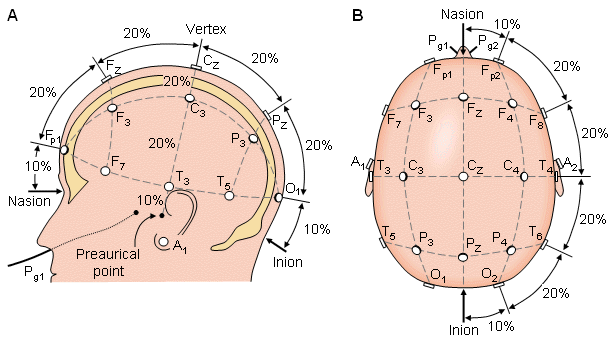
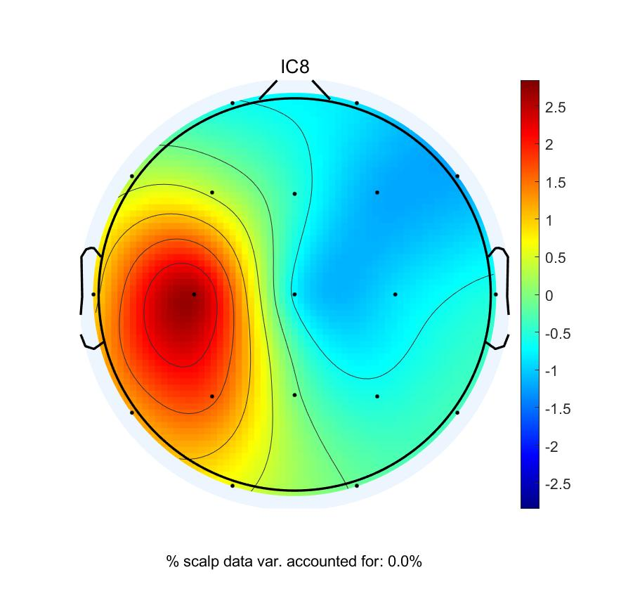

# Electroencephalography BioMarker(Signals&Systems Project)

 Preprocessing Electroencephalography (EEG) signals and employing
 some analytical simulations such as PLV and ttest on them, was 
 the main task of this project. Three group of people(AD:Alzheimer’s
 Disease-normal-MCI:Mild Cognitive Impairment) were examined(By 
 different odor sensing) and brain EEG signals were provided to
 do this task. Moreover, the relation between the three subjects
 and possible transition were analyzed. Entire project was carried out via 
 matlab and toolbox EEGlab.

    

    

**Project.mlx** is the main file. For further inspection and running you might need other files(e.g files in EEG BioMarker.zip) 
 *July 2023 Sharif*
 

